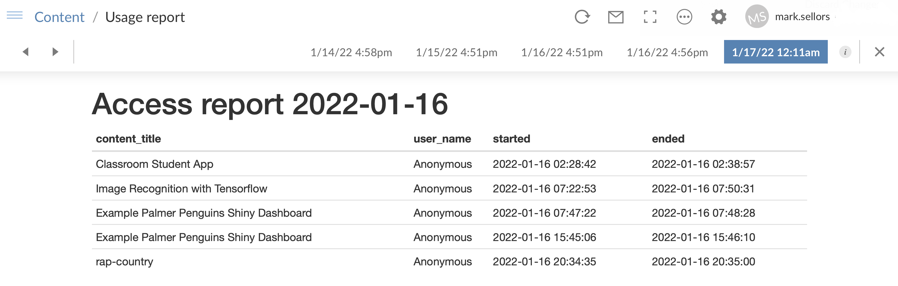

# Connect Usage Reporting

A small Rmarkdown document that pulls app usage data from the RStudio Connect 
API and displays it in a table.

## Installation

You can deploy this project 
[directly from git](https://docs.rstudio.com/connect/user/git-backed/)
and it should work out-of-the-box on Connect instances with version 1.9.0 and
above. If you do so, please ensure you select the correct branch, `main`.

For versions of Connect older than that YMMV, but you could try setting the 
following environment variables in the config panel for the app once it's been
deployed:

* CONNECT_SERVER
* CONNECT_API_KEY

Set `CONNECT_SERVER` to the URL for your connect instance, eg. 
`https://rstudio.example.com/rsc` and `CONNECT_API_KEY` to your 
[RStudioConnect API Key](https://docs.rstudio.com/connect/user/api-keys/)

## Usage
 
 Once the report is deployed to Connect you should do the following additional 
 actions:
 
 * Set the report to run once a day, any time after midnight is fine as the 
 report always get's __yesterday's__ data anyway.
 * Make sure "Publish output after it is generated" is checked.
 
 This will ensure that Connect keeps older versions of the report and you'll be
 able to view those using the "History" option as seen in the screenshot above.
 
## License

MIT © [Mark Sellors](https://github.com/sellorm)

